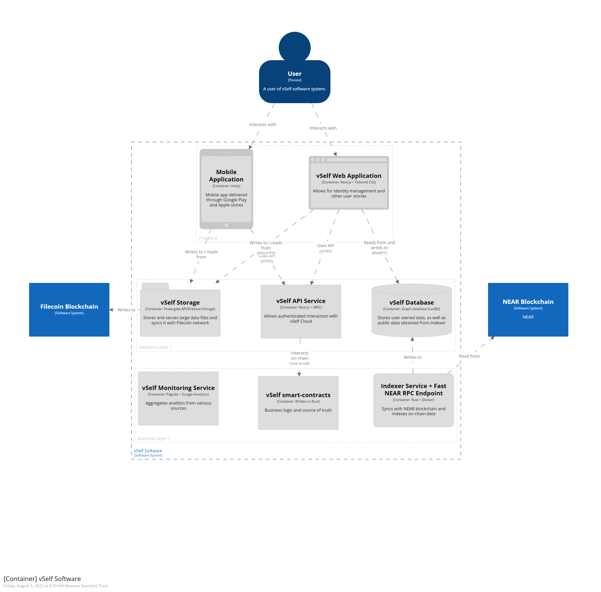
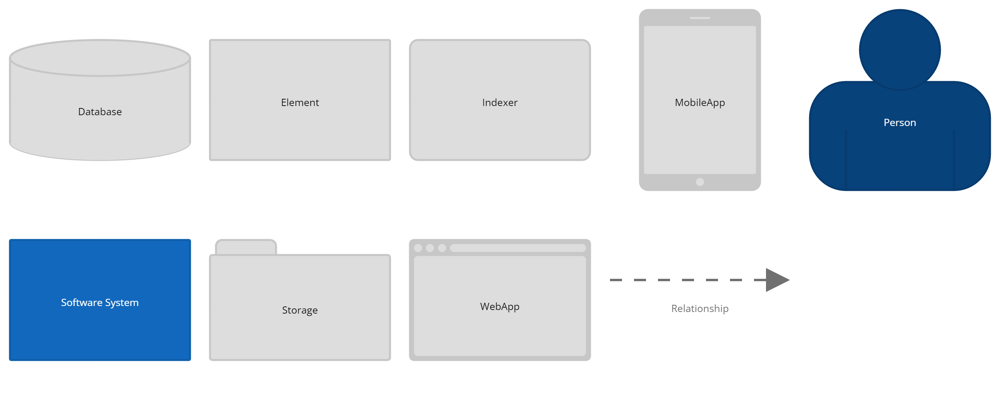

## vSelf Architecture

This section tries to provide complete model for our system architecture via DSL of [C4model](https://c4model.com/). To render the system model we use online tooling https://structurizr.com/dsl.

vSelf is an open source software system governed and maintained by vSelf DAO, i.e. it is a digital agent which provides it's users with identity management tools and other covenient features for open web experiece. and well as iterfaces. It consists of a user facing frontend applications and backend cloud infrastructure to support and deviver them to the edge.

### Frontend (Web / Mobile)

Web application (runs in the browser) acts as a secure digital wallet and handles all client side secrets, credentials and cryptography. It's currently based off [T3]() (Typescript/Tailwind CSS/tRPC) tech stack and is delivered through Google owned CDN (Firebase Hosting).

Another option we are currently developing is [Unity]() based mobile application which can be obtained through Google Play and App Store. It uses web application (wallet) to pass authentication via deeplink mechanism.

All frontend applications are using vSelf API for data fetching, session management and for interacting with other vSelf subsystems. As we are using [Next.js]() framework it allows us to implement server side logic in Typescript and use it for typesafe endpoints impelementation.

The cloud based backend can be decoupled in two logical layers. The first part consists of the services directly interacting with user applications, and the other one runs in the cloud and doesn't affect UX directly.

## Layer 1 (API, Database, Storage/CDN)

The main vSelf API service serves as a bridge between frontend applications and backend services. It communicates with vSelf databases, smart-contracts and any 3rd party APIs which is required. Also it it implements authentication and authorization mechanisms (with [next-auth]()) for access control and identity management. The service is implemented in Typescript and shares codebase with web application.

For realtime data storage we chose to go with [GunDB]() distributed graph database. It has several distinc features that we find usefull and particulary relevant to web3 world. It provides us with offline-first storage solution on client side and fast data syncronisation protocol with conflict resolution. We are hosting in our cloud relay GunDB nodes and do backups on regular basis using our storage subsystem described in the next section.

The Storage service is responsible for long term storage of immutable data (like big media files), backups. We believe [IPFS] will be the standart in the future so we plan to host Lotus node, along other classical storage solutions. The other part of the service manages external distributed storage (e.g. [Filecoin]) and if feasible makes storage deals on systems behalf and uploads data to the network. Specifically for integration with Filecoin we take recommended approach and using [PowergateAPI].

### Layer 2 (Contracts, NEAR Indexer, Monitoring)

Deeper backend layer is concerned with business logic / smart-contracts, analytics tools and cloud infrastructure management. 

The main part and business logic involving any value transfer is exectude and verified on-chain. For this we develop a set of smart-contracts written in Rust (using [NEAR SDK]()). Until governance mechanism is developed and tested, we are fully responsible for deployment and migrations. But once vSelf DAO is ready it's possible to pass admin rights to some consortium of users who will make decicions on behalf of the community.

The second one is Indexer service which serves two purposes. First it is responsible for the NEAR blockchain RPC endpoint, so it runs it's own instance of NEAR (currently falls back to services like Infura) and makes sure our cloud never lose connectivity to the blockchain network. Then Indexer watches every blockchain state update and maps all relevant data to our internal representation which is delivered to the GunDB database.

Lastly for monitoring there is a separate service which aggregates analytics and logs from different sources and subsystems. It's goal is twofold - on one hand we need to provide our dev-ops with real-time data on systems health and operational status, on the other hand management needs access the usage metrics for customer development and feature planning. Currently it's going to be Pagoda for on-chain analytics, and [Firebase SDK] for frontend applications. But as we are going through evolution we plan to develop custom tooling and integrate more metrics and data sources.

To sum it up: on the scheme below we depicted high-level view of the systems architecture.

